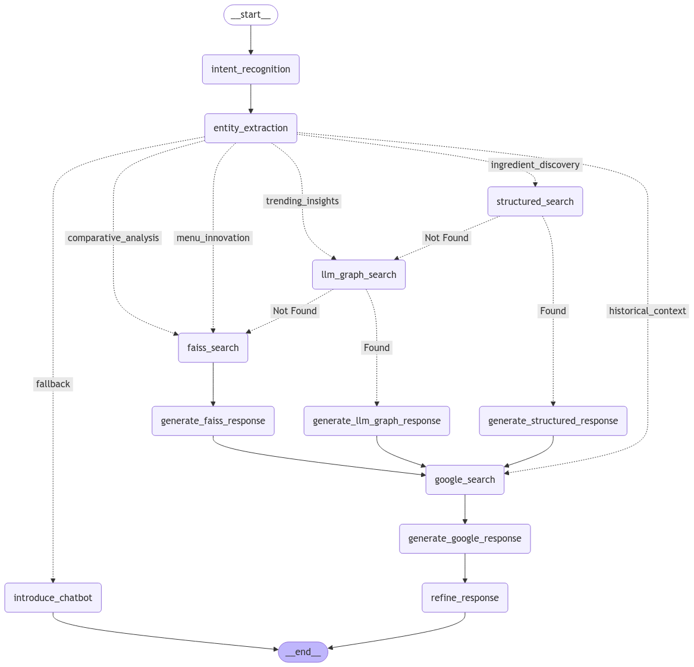

# Conversational AI for Restaurant Insights

## Overview
This project implements an **Agentic AI** chatbot that provides restaurant-related insights, including menu recommendations, ingredient discovery, and trending food insights. It integrates structured and unstructured data retrieval using **FAISS**, **SQL-like database queries**, **Knowledge Graph search**, and **Google Search API** to ensure comprehensive responses.

## Features
- **FAISS-based similarity search** for restaurant and menu recommendations
- **Structured SQL-like database queries** for precise restaurant details
- **Knowledge Graph search (Neo4j)** for multi-hop reasoning
- **Google Search API** for real-time external data retrieval
- **LangGraph for Asynchronous Processing** to optimize multi-agent retrieval
- **Conversational UI with Streamlit**

## Installation
To set up the environment, install dependencies from `requirements.txt`:
```bash
pip install -r requirements.txt
```

### Environment Variables
Before running the application, create a .env file and add the following credentials:
```bash
GROQ_API_KEY=your_groq_api_key
NEO4J_URI=your_neo4j_uri
NEO4J_USER=your_neo4j_username
NEO4J_PASSWORD=your_neo4j_password
```
You need an account on GROQ LLM and Neo4j to run this application.

## Project Structure
```
📂 chatbot
 ├── chatbot.py  # Core chatbot execution
 ├── intent_recognition.py  # Detects user intent
 ├── entity_extraction.py  # Extracts entities (restaurant, menu, ingredients)
 ├── structured_db_search.py  # Queries the structured menu database
 ├── faiss_search.py  # Searches FAISS for similar menu items
 ├── google_search.py  # Fetches data from Google
 ├── llm_graph_search.py  # Queries the knowledge graph
 ├── response_generator.py  # Structures and refines responses
 ├── state.py  # Defines state management
 ├── config.py  # LLM configuration
 ├── langgraph_workflow.py  # Defines the LangGraph-based retrieval workflow
cleaned_menu_data.csv  # Aggregated menu data with ingredients
faiss_index.bin  # FAISS index file (to be created)
metadata.pkl  # Metadata for FAISS (to be created)
ui.py  # Streamlit-based user interface
database.py  # Builds the FAISS database from cleaned_menu_data.csv
app.py  # Main application entry point
```

## Workflow


1. **User Query Processing**
   - Extracts entities (restaurant name, ingredient, etc.)
   - Identifies user intent (ingredient discovery, trending insights, etc.)

2. **Retrieval Pipeline (Multi-Agent System)**
   - **FAISS Search**: Finds similar menu items.
   - **Structured Database Search**: Queries preprocessed restaurant data.
   - **Knowledge Graph Search**: Uses Neo4j to retrieve multi-hop relationships.
   - **Google Search API**: Fetches real-time external knowledge.

3. **Response Generation**
   - Aggregates and ranks results.
   - Uses LLM to refine and structure responses.
   - Formats output for conversational interaction.

## Running the Application
### 1. Build the FAISS Database
Before running the chatbot, create the FAISS index using:
```bash
python scripts/database.py
```
Ensure that `cleaned_menu_data.csv` is available in the `/data` folder.

### 2. Start the Chatbot
Run the chatbot using:
```bash
python app.py
```
This launches a **Streamlit UI** where users can interact with the chatbot.

## Future Enhancements
- **Asynchronous execution with LangGraph**: Currently, retrieval is done sequentially. Future improvements will enable parallel processing of FAISS, structured DB, and Neo4j queries to reduce latency.
- **Trend & Menu Innovation Agent**: A dedicated agent will be developed to track real-time food trends, analyzing ingredient popularity and menu innovation.
- **Support for Additional Data Sources**: Integration with restaurant review APIs, food blogs, and social media for trend tracking.

## Credits
Developed for the **Menudata Challenge** by **Dhiraj Pimparkar**.

